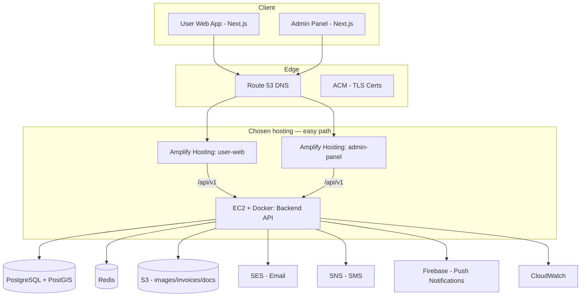
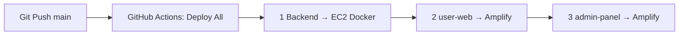
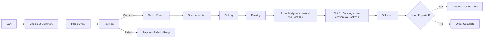
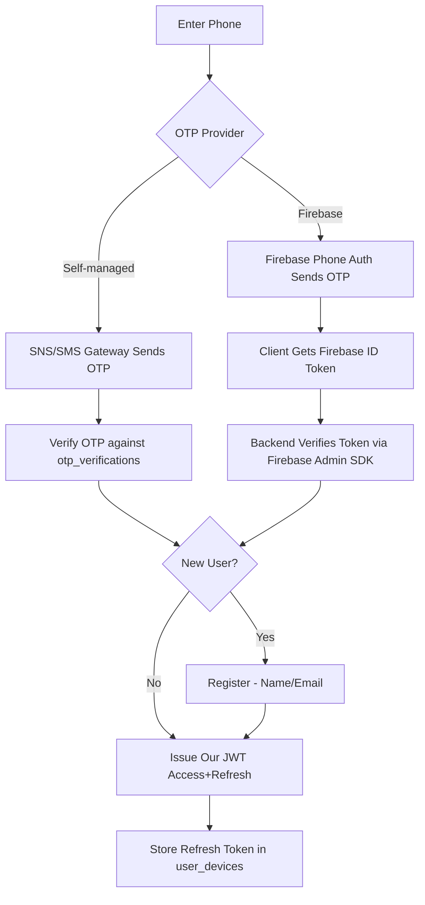
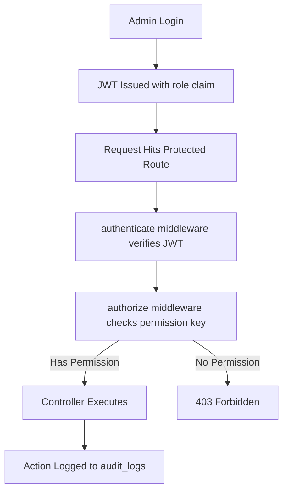
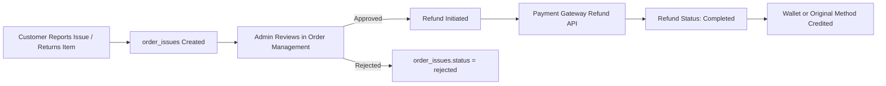
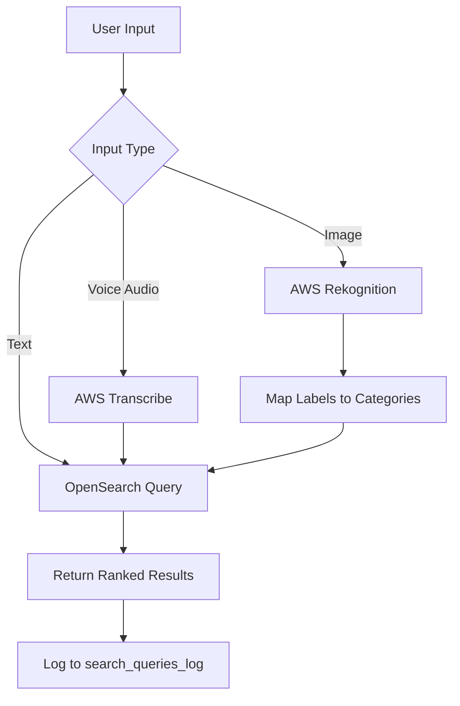
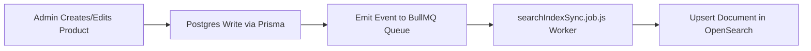
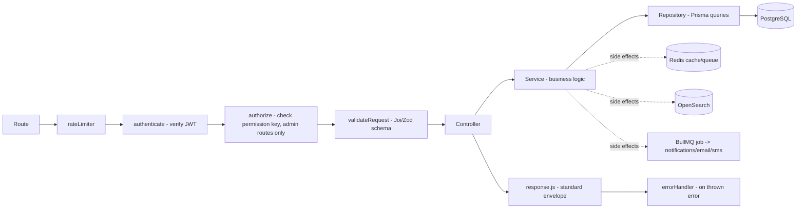

# Blinkit-Clone (Single Store) — Full Technical Specification (v2)

> **Purpose of this document:** Single source of truth for the backend (Node.js), **customer User Web App (Next.js)**, admin panel (Next.js), database, AWS infrastructure, and Firebase integration for a single-store quick-commerce platform — architected for future multi-store reuse by config change only. Any AI or developer picking up this repo should be able to build and deploy the entire system from this file alone.

> **v2 changelog:** Added AWS service architecture (RDS, S3, ElastiCache, OpenSearch, SES, SQS, CloudFront, etc.), Firebase integration (FCM + optional Phone Auth), PostGIS geospatial schema for nearest-store/delivery-radius logic, missing tables for smart features (activity tracking, translations, substitutions, notification templates), search architecture, caching strategy, deployment/CI-CD, backup & DR, and closed all requirement gaps identified in v1.

> **v2.2 changelog (2026-08-06):** Added **§21 Implementation Status** — live tracker of Milestone 1 completion (DB tables, API endpoints, admin panel, Docker, tests, env vars, known deviations).

> **v2.3 changelog (2026-08-06):** Updated §21 after M1 gap-closure — GIST automation, global audit + 5-day purge, refresh hashes on `user_devices`/`admin_users`, S3 client, PermissionGate, seed staff/customers. Deferred optional keys → [`DO_THAT_LATER.md`](./DO_THAT_LATER.md).

> **v2.4 changelog (2026-08-08):** Brought **User Web App (Next.js)** into owned scope — pixel-perfect parity with Blinkit customer web (`blinkit.com`). Added §5A folder structure, §19A screen/UI pixel-parity spec, updated §1–§3, §13, §15–§17, §21, and monorepo layout. Native iOS/Android apps remain out of scope.

> **v2.5 changelog (2026-08-08):** Locked **User Web M1 Blinkit-parity account UI** — Account dropdown, account sidebar layout, My Addresses list, and two-column **Enter complete address** modal (map + form). Storefront brand wordmark = **Tapi Grocery** (slug remains `blinkit-store`). Updated §5A tree, §19A.2, §21.5A, README / audit / user-web README.

> **v2.7 changelog (2026-08-08):** Locked frontend hosting to **AWS Amplify only** (no CloudFront / ECS for `user-web` or `admin-panel`). Backend deploy = EC2 Docker. Single GitHub Actions workflow deploys all three in order. CloudFront remains optional later for S3 image CDN only.

---

## 1. Project Scope (Strict)

- Build **only** what is listed in the client's feature list (Website Features + Admin Panel sections, §16).
- **No extra features.** No multi-store logic in the UI/business flow — but data model must isolate store-specific config so onboarding a second store later = updating config/env, not rewriting code.
- Scope owned by this team: **Backend (Node.js) + User Web App (Next.js) + Admin Panel (Next.js) + Database + AWS Infra**.
- **User Web App UI requirement:** Pixel-perfect, same-to-same visual and interaction parity with the live **Blinkit customer web application** ([blinkit.com](https://blinkit.com)) — layout, spacing, typography, colors, components, and responsive breakpoints. See **§19A**.
- Backend exposes REST APIs consumed by both the **User Web App** and the **Admin Panel**.
- **Not** in scope: native iOS/Android apps (User Web + Admin Web only).

### 1.1 Single-Store, Multi-Store-Ready Principle
- One `stores` table exists but only **one row is active** for this deployment (`is_active = true`).
- All store-scoped resources (products, orders, inventory, riders) carry a `store_id` FK, defaulted to the single store via config/env (`DEFAULT_STORE_ID`), so no UI/API changes are needed to onboard store #2 — just seed a new row, point DNS, redeploy with new env values.
- No cross-store switching UI, no store-selection logic anywhere in the app layer — that would be an extra feature. The isolation exists **only** at the schema level for future reuse.

---

## 2. Tech Stack

| Layer | Technology |
|---|---|
| Backend | Node.js (Express.js), REST APIs |
| User Web App | Next.js (App Router) — customer storefront; **pixel-perfect Blinkit web UI** |
| Admin Panel | Next.js (App Router) — internal operations dashboard |
| Database | PostgreSQL 15+ with **PostGIS** extension, hosted on **AWS RDS** |
| ORM | Prisma |
| Cache / Queue | **AWS ElastiCache (Redis)** — OTP, sessions, rate limiting, BullMQ job queues |
| Search | **AWS OpenSearch Service** — instant search, voice search, suggestions, typo-tolerant product search |
| Auth | JWT (access + refresh) issued by our backend; OTP via SMS provider or **Firebase Phone Auth**; OAuth (Google/Apple) |
| File Storage | **AWS S3** (product images, invoices, review images, KYC docs) |
| CDN (images only, optional later) | **Not required for app hosting.** S3 public URLs or Amplify-served assets are enough for M1–M2; CloudFront in front of S3 is optional later for image CDN only — **never** used to host `user-web` / `admin-panel` |
| Realtime | Socket.IO (self-hosted) for live order tracking, rider location |
| Push Notifications | **Firebase Cloud Messaging (FCM)** |
| SMS | AWS SNS (SMS) or third-party SMS gateway (MSG91/Twilio) — whichever the client's telecom region needs |
| Email | **AWS SES** |
| WhatsApp | WhatsApp Business Cloud API |
| Payments | Razorpay/Stripe-style gateway (UPI, Card, Net Banking, Wallet, COD) |
| Compute (Backend) | **EC2** (Docker Compose) for current deploy; ECS Fargate + ALB is the longer-term option in IaC |
| Compute (User Web App) | **AWS Amplify Hosting only** (Next.js SSR — chosen because it is simplest; no CloudFront / ECS for the storefront) |
| Compute (Admin Panel) | **AWS Amplify Hosting only** (Next.js SSR — same as user-web; no CloudFront / ECS for admin) |
| Background Jobs | BullMQ workers on ECS Fargate, backed by ElastiCache Redis |
| Secrets | **AWS Secrets Manager** |
| Monitoring/Logs | **AWS CloudWatch** (logs, alarms, dashboards) + optional Sentry for error tracking |
| Image Recognition (image-based search) | **AWS Rekognition** |
| Speech-to-Text (voice search) | **AWS Transcribe** (or browser/device STT from User Web App; backend may receive text only) |
| DNS / SSL | **AWS Route 53** + **AWS Certificate Manager (ACM)** |
| IaC | Terraform (recommended) for reproducible AWS provisioning |
| CI/CD | **One** GitHub Actions workflow: backend → EC2, then `user-web` → Amplify, then `admin-panel` → Amplify |

---

## 3. AWS Architecture Overview



> **Hosting decision:** `user-web` and `admin-panel` run on **AWS Amplify Hosting only** (simplest Next.js path). **Do not** put the frontends behind CloudFront or ECS. CloudFront is **not** part of the app hosting stack; S3 object URLs are enough for images until a later optional CDN is needed.

### 3.1 Rationale per service
| Requirement | AWS/Firebase Service | Why |
|---|---|---|
| Relational data, geospatial nearest-store filtering | RDS PostgreSQL + PostGIS | Managed, automated backups, PostGIS gives `ST_DWithin` queries for delivery radius / nearest area filtering |
| OTP, sessions, rate limiting, job queue | ElastiCache Redis | Sub-ms latency, managed failover |
| Instant/voice search, typo tolerance, autosuggest | OpenSearch | Postgres LIKE/ILIKE doesn't scale for autosuggest at product-catalog volume |
| Images, invoices, KYC/rider docs | S3 (CloudFront optional later) | Durable object storage; **no CloudFront required** to ship — Amplify hosts the apps, not CloudFront |
| Push notifications | Firebase Cloud Messaging | Cross-platform (Android/iOS/Web) push is Firebase's core strength; avoids building our own push infra |
| Phone OTP (optional) | Firebase Phone Auth | Can replace custom SMS-OTP build-out if client prefers Firebase-managed OTP; otherwise SNS/SMS gateway + our own `otp_verifications` table |
| Email | SES | Cheap, scalable transactional email with our own domain |
| SMS | SNS or SMS gateway | SNS works well for India via SNS SMS or a local aggregator (MSG91) depending on delivery reliability needs |
| Secrets (DB creds, API keys) | Secrets Manager | No secrets in `.env` in production; rotated automatically |
| Image-based product search | Rekognition | Label detection to match uploaded photo → closest matching product categories |
| Voice search transcription | Transcribe | Converts audio to text server-side if the app sends raw audio instead of doing on-device STT |
| Monitoring | CloudWatch | Centralized logs, custom metrics (order volume, API latency), alarms → SNS → Slack/email |

---

## 4. Backend Folder Structure (Node.js)

```
backend/
├── src/
│   ├── config/
│   │   ├── env.js                  # loads/validates env vars (via Secrets Manager in prod)
│   │   ├── database.js             # Prisma client instance
│   │   ├── redis.js                # ElastiCache client
│   │   ├── storage.js              # S3 client
│   │   ├── search.js               # OpenSearch client
│   │   ├── aws.js                  # shared AWS SDK v3 clients (SES, SNS, Rekognition, Transcribe, Secrets Manager)
│   │   ├── firebase.js             # Firebase Admin SDK init (FCM, optional Phone Auth verification)
│   │   └── constants.js            # roles, order statuses, enums
│   │
│   ├── modules/                    # feature-first structure
│   │   ├── auth/
│   │   ├── users/
│   │   ├── addresses/
│   │   ├── categories/
│   │   ├── brands/
│   │   ├── products/
│   │   ├── inventory/
│   │   ├── cart/
│   │   ├── wishlist/
│   │   ├── orders/
│   │   ├── order-tracking/
│   │   ├── payments/
│   │   ├── refunds/
│   │   ├── coupons/
│   │   ├── banners/
│   │   ├── wallet/
│   │   ├── notifications/
│   │   ├── reviews/
│   │   ├── support-tickets/
│   │   ├── riders/
│   │   ├── admin-users/            # roles/permissions/RBAC
│   │   ├── reports/
│   │   ├── search/                 # OpenSearch-backed search + image/voice search
│   │   ├── recommendations/        # personalized feed, substitutions, out-of-stock alternatives
│   │   ├── i18n/                   # multi-language content
│   │   └── store-settings/
│   │       └── (each module: controller, service, routes, validator, repository)
│   │
│   ├── middlewares/
│   │   ├── authenticate.js         # JWT verify
│   │   ├── authorize.js            # RBAC permission check
│   │   ├── rateLimiter.js          # Redis-backed
│   │   ├── errorHandler.js
│   │   ├── validateRequest.js      # joi/zod schema runner
│   │   └── auditLogger.js
│   │
│   ├── sockets/
│   │   ├── index.js
│   │   └── orderTracking.socket.js
│   │
│   ├── jobs/                       # BullMQ workers
│   │   ├── notification.job.js
│   │   ├── invoice.job.js
│   │   ├── walletReconciliation.job.js
│   │   ├── searchIndexSync.job.js  # keeps OpenSearch in sync with Postgres on product changes
│   │   └── fraudCheck.job.js
│   │
│   ├── integrations/
│   │   ├── payment-gateway/
│   │   ├── sms-provider/           # SNS or 3rd-party gateway
│   │   ├── maps-provider/
│   │   ├── fcm/                    # Firebase Admin SDK wrapper
│   │   ├── whatsapp/
│   │   ├── rekognition/            # image-based product search
│   │   └── transcribe/             # voice search transcription
│   │
│   ├── utils/
│   │   ├── logger.js               # structured logs -> CloudWatch
│   │   ├── response.js             # standard API response wrapper
│   │   ├── pagination.js
│   │   ├── geo.js                  # PostGIS helper queries
│   │   └── generateInvoice.js
│   │
│   ├── database/
│   │   ├── prisma/
│   │   │   ├── schema.prisma
│   │   │   ├── migrations/
│   │   │   └── seed.js
│   │
│   ├── app.js                      # express app setup
│   └── server.js                   # entry point
│
├── infra/                          # Terraform IaC
│   ├── vpc.tf
│   ├── rds.tf
│   ├── elasticache.tf
│   ├── opensearch.tf
│   ├── ecs.tf
│   ├── s3-cloudfront.tf
│   ├── secrets.tf
│   └── iam.tf
│
├── tests/
├── .env.example
├── Dockerfile
├── package.json
└── README.md
```

---

## 5. Admin Panel Folder Structure (Next.js — App Router)

```
admin-panel/
├── app/
│   ├── (auth)/
│   │   ├── login/page.tsx
│   │   └── forgot-password/page.tsx
│   │
│   ├── (dashboard)/
│   │   ├── layout.tsx              # sidebar + RBAC route guard
│   │   ├── dashboard/page.tsx      # totals: users, orders, revenue, live orders
│   │   ├── users/
│   │   │   ├── customers/page.tsx
│   │   │   ├── delivery-partners/page.tsx
│   │   │   ├── store-managers/page.tsx
│   │   │   └── admin-roles/page.tsx
│   │   ├── catalog/
│   │   │   ├── categories/page.tsx
│   │   │   ├── sub-categories/page.tsx
│   │   │   ├── products/page.tsx
│   │   │   ├── products/[id]/page.tsx
│   │   │   ├── brands/page.tsx
│   │   │   ├── inventory/page.tsx
│   │   │   └── variants/page.tsx
│   │   ├── orders/
│   │   │   ├── page.tsx
│   │   │   ├── [id]/page.tsx
│   │   │   ├── refunds/page.tsx
│   │   │   ├── cancellations/page.tsx
│   │   │   ├── returns/page.tsx
│   │   │   └── disputes/page.tsx
│   │   ├── promotions/
│   │   │   ├── coupons/page.tsx
│   │   │   ├── banners/page.tsx
│   │   │   └── deals/page.tsx
│   │   ├── payments/
│   │   │   ├── reconciliation/page.tsx
│   │   │   ├── refunds/page.tsx
│   │   │   └── wallet/page.tsx
│   │   ├── reports/
│   │   │   ├── sales/page.tsx
│   │   │   ├── revenue/page.tsx
│   │   │   ├── order-trends/page.tsx
│   │   │   ├── customer-retention/page.tsx
│   │   │   ├── product-performance/page.tsx
│   │   │   └── inventory/page.tsx
│   │   ├── support/
│   │   │   └── tickets/page.tsx
│   │   ├── settings/
│   │   │   ├── store-details/page.tsx   # single-store config, reused when cloning
│   │   │   ├── roles-permissions/page.tsx
│   │   │   └── languages/page.tsx       # manage translated content
│   │   └── audit-logs/page.tsx
│   │
│   ├── api/                        # (optional) BFF proxy routes only if needed
│   ├── layout.tsx
│   └── globals.css
│
├── components/
│   ├── ui/                         # buttons, tables, modals, forms (design system)
│   ├── charts/
│   ├── layout/
│   │   ├── Sidebar.tsx
│   │   ├── Topbar.tsx
│   └── guards/
│       └── PermissionGate.tsx      # component-level RBAC
│
├── lib/
│   ├── api-client.ts               # axios instance, interceptors, refresh token
│   ├── auth.ts                     # session/JWT handling
│   ├── rbac.ts                     # permission-checking helpers
│   └── utils.ts
│
├── hooks/
│   ├── useAuth.ts
│   ├── usePermission.ts
│   └── useSocket.ts                # live orders/tracking updates
│
├── services/                       # one file per backend module, thin API wrappers
│   ├── dashboard.service.ts
│   ├── users.service.ts
│   ├── products.service.ts
│   ├── orders.service.ts
│   ├── promotions.service.ts
│   ├── payments.service.ts
│   └── reports.service.ts
│
├── store/                          # Zustand/Redux state
│   ├── authStore.ts
│   └── uiStore.ts
│
├── types/
│   └── *.d.ts                      # shared TypeScript types matching API contracts
│
├── middleware.ts                   # route-level auth + RBAC guard (Next middleware)
├── .env.example
├── Dockerfile
├── package.json
└── README.md
```

---

## 5A. User Web App Folder Structure (Next.js — App Router)

Customer storefront in `user-web/`. UI must match Blinkit web pixel-for-pixel (§19A). Consumes the same `/api/v1` user APIs as documented in §8.1–§8.11.

```
user-web/
├── app/
│   ├── (auth)/
│   │   └── login/page.tsx              # OTP + email login (Blinkit-style modal/sheet via LoginModal)
│   │
│   ├── (shop)/
│   │   ├── layout.tsx                  # header: logo, location bar, search, Account, cart
│   │   ├── page.tsx                    # home shell — banners/categories placeholders (§16.1 full → M2)
│   │   ├── account/
│   │   │   ├── layout.tsx              # Blinkit account shell (sidebar + content)
│   │   │   ├── page.tsx                # redirects → /account/addresses
│   │   │   ├── addresses/page.tsx      # My Addresses list + opens AddressModal
│   │   │   └── settings/page.tsx       # Account privacy: profile, language, delete
│   │   └── …                           # search / c / pr / cart / checkout / orders → M2+
│   │
│   ├── layout.tsx
│   ├── globals.css                     # Blinkit design tokens
│   └── not-found.tsx
│
├── components/
│   ├── layout/
│   │   ├── Header.tsx                  # logo | location+ETA | search | Account | My Cart
│   │   ├── BrandLogo.tsx               # Tapi Grocery wordmark
│   │   ├── LocationBar.tsx
│   │   ├── SearchBar.tsx               # rotating placeholder animation
│   │   ├── ProfileButton.tsx           # Login | Account dropdown (My Account menu)
│   │   ├── CartButton.tsx              # grey disabled until M2 cart
│   │   ├── BottomNav.tsx
│   │   ├── Footer.tsx
│   │   ├── AuthHydration.tsx
│   │   └── SessionKeepAlive.tsx
│   ├── account/
│   │   ├── AccountSidebar.tsx          # phone + My Addresses / privacy / Logout
│   │   └── AddressModal.tsx            # map + “Enter complete address” form (portal)
│   ├── auth/
│   │   └── LoginModal.tsx
│   └── home/
│       └── HomeContent.tsx             # M1 shell; full shelves → M2
│
├── lib/
│   ├── api-client.ts                   # axios + refresh interceptor (user JWT, 15 min access)
│   ├── auth.ts
│   ├── design-tokens.ts
│   ├── token-refresh.ts
│   └── utils.ts
│
├── services/                           # M1: auth / users / addresses (§8.1–§8.3)
│   ├── auth.service.ts
│   ├── users.service.ts
│   └── addresses.service.ts
│
├── store/                              # Zustand
│   ├── authStore.ts
│   ├── locationStore.ts
│   └── uiStore.ts
│
├── types/
│   └── api.d.ts
│
├── middleware.ts                       # protect /account/*
├── .env.example
├── package.json
└── README.md
```

> **Target tree (full product):** When implementing M2+, add routes/components from the original §5A plan (`search/`, `c/[categorySlug]/`, `pr/[productSlug]/`, `cart/`, `checkout/`, `orders/`, `wishlist/`, product shelves, cart store, etc.). M1 intentionally ships only auth + account/addresses chrome.

**Local ports (convention):** User Web `http://localhost:3001` · Admin Panel `http://localhost:3000` · API `http://localhost:4000`.

---

## 6. Database Schema (PostgreSQL + PostGIS, via Prisma) — Optimized

Design principles: normalized core catalog/order data, `store_id` on every store-scoped table for future multi-store reuse, indexed foreign keys, soft-deletes (`deleted_at`) on user-facing entities, `created_at`/`updated_at` everywhere, **geography columns via PostGIS** for distance queries, partitioning on high-write time-series tables.

### 6.1 Store & Config
```
stores
  id (PK), name, slug, logo_url, address, location geography(Point,4326),
  contact_phone, contact_email, delivery_radius_km,
  min_order_value, is_active, timezone, currency,
  created_at, updated_at
  -- GIST index on `location` for nearest-area / delivery-radius queries (ST_DWithin)

store_settings                      -- key/value store for tunables (fees, timings)
  id (PK), store_id (FK -> stores), key, value, created_at, updated_at
```

### 6.2 Identity, Auth & RBAC
```
users                                -- customers
  id (PK), phone, email, name, password_hash (nullable, OTP-first),
  auth_provider (phone|google|apple|firebase), provider_id, language_pref,
  is_active, deleted_at, created_at, updated_at

otp_verifications                    -- used only if NOT delegating OTP to Firebase Phone Auth
  id (PK), phone/email, otp_hash, purpose (login|signup|delete_account),
  expires_at, verified_at, attempts, created_at

user_devices                         -- device/session management
  id (PK), user_id (FK), device_id, fcm_token, platform,
  last_active_at, is_revoked, created_at

addresses
  id (PK), user_id (FK -> users), label (home|work|other),
  full_address, location geography(Point,4326), landmark, is_default,
  created_at, updated_at
  -- GIST index on `location`

admin_users                          -- staff, store managers, super admin
  id (PK), store_id (FK, nullable for super_admin), name, email,
  password_hash, role_id (FK -> roles), is_active, deleted_at,
  created_at, updated_at

roles
  id (PK), name (super_admin|store_manager|catalog_manager|order_manager|support_agent...),
  description, created_at

permissions
  id (PK), key (e.g. "orders.view", "products.edit"), description

role_permissions
  id (PK), role_id (FK), permission_id (FK)

audit_logs                           -- PARTITIONED BY RANGE (created_at), monthly
  id (PK), admin_user_id (FK), action, entity, entity_id,
  ip_address, meta (jsonb), created_at
```

### 6.3 Catalog
```
categories
  id (PK), store_id (FK), name, slug, image_url, parent_id (self FK, nullable),
  sort_order, is_active, created_at, updated_at

category_translations                -- multi-language support
  id (PK), category_id (FK), locale (en|hi|...), name

brands
  id (PK), store_id (FK), name, logo_url, is_active, created_at, updated_at

products
  id (PK), store_id (FK), category_id (FK), brand_id (FK, nullable),
  name, slug, description, nutritional_info, ingredients,
  shelf_life, storage_instructions, manufacturer_details,
  is_active, deleted_at, created_at, updated_at

product_translations                 -- multi-language support
  id (PK), product_id (FK), locale, name, description

product_variants                     -- weight/size/price per SKU
  id (PK), product_id (FK), sku, weight_or_size, mrp, selling_price,
  discount_percent, is_active, created_at, updated_at

product_images
  id (PK), product_id (FK), variant_id (FK, nullable), s3_key, cdn_url, sort_order

inventory
  id (PK), store_id (FK), variant_id (FK -> product_variants),
  quantity_available, quantity_reserved, low_stock_threshold,
  updated_at

product_related                      -- related / frequently-bought-together / substitutes
  id (PK), product_id (FK), related_product_id (FK),
  type (related|fbt|substitute)       -- 'substitute' powers out-of-stock alternative suggestions
```

### 6.4 Cart & Wishlist
```
carts
  id (PK), user_id (FK), store_id (FK), created_at, updated_at

cart_items
  id (PK), cart_id (FK), variant_id (FK), quantity,
  saved_for_later (bool), created_at, updated_at

wishlists
  id (PK), user_id (FK), variant_id (FK), created_at
```

### 6.5 Orders & Tracking
```
orders                                -- PARTITIONED BY RANGE (created_at), monthly, for scale
  id (PK), store_id (FK), user_id (FK), address_id (FK),
  order_number (unique), status (placed|accepted|picking|packing|
    rider_assigned|out_for_delivery|delivered|cancelled|returned),
  subtotal, delivery_fee, platform_fee, handling_fee, tax_amount,
  discount_amount, wallet_amount_used, total_amount,
  payment_id (FK -> payments, nullable), coupon_id (FK, nullable),
  delivery_instructions, delivery_location geography(Point,4326),
  estimated_delivery_at, delivered_at,
  cancelled_at, cancel_reason, created_at, updated_at

order_items
  id (PK), order_id (FK), variant_id (FK), product_name_snapshot,
  quantity, unit_price, discount_amount, total_price

order_status_history
  id (PK), order_id (FK), status, changed_by (admin_user_id, nullable),
  note, created_at

rider_assignments
  id (PK), order_id (FK), rider_id (FK -> riders), assigned_at,
  accepted_at, picked_up_at, delivered_at, status

order_locations                       -- live rider pings; mirrored to Redis for hot reads,
  id (PK), order_id (FK), rider_id (FK),           -- persisted here for history/audit
  location geography(Point,4326), recorded_at

order_issues                          -- missing/damaged item reports
  id (PK), order_id (FK), order_item_id (FK, nullable), user_id (FK),
  type (missing|damaged|other), description, images (jsonb),
  status (open|resolved|rejected), resolved_at, created_at
```

### 6.6 Riders / Delivery Partners
```
riders
  id (PK), store_id (FK), name, phone, vehicle_type,
  document_urls (jsonb), status (available|busy|offline),
  current_location geography(Point,4326), is_active, created_at, updated_at
  -- GIST index on current_location for nearest-rider assignment
```

### 6.7 Payments, Refunds, Wallet
```
payments
  id (PK), order_id (FK), method (upi|card|netbanking|wallet|cod|gift_card),
  gateway_reference, amount, status (pending|success|failed|refunded),
  paid_at, created_at, updated_at

refunds
  id (PK), order_id (FK), payment_id (FK), amount, reason,
  status (initiated|processing|completed|rejected),
  processed_at, created_at

wallets
  id (PK), user_id (FK, unique), balance, created_at, updated_at

wallet_transactions
  id (PK), wallet_id (FK), type (credit|debit), amount, reason,
  reference_order_id (nullable), created_at

gift_cards
  id (PK), code (unique), amount, is_redeemed, redeemed_by (FK -> users),
  expires_at, created_at
```

### 6.8 Promotions
```
coupons
  id (PK), store_id (FK), code (unique), description,
  discount_type (flat|percent), discount_value, max_discount,
  min_order_value, usage_limit_per_user, total_usage_limit,
  used_count, valid_from, valid_to, is_active, created_at

banners
  id (PK), store_id (FK), image_url, redirect_type (category|product|url),
  redirect_value, sort_order, is_active, start_at, end_at

deals                                 -- flash deals
  id (PK), store_id (FK), product_variant_id (FK), deal_price,
  starts_at, ends_at, is_active
```

### 6.9 Notifications & Support
```
notification_templates                -- reusable copy per channel/locale
  id (PK), key, channel (push|sms|email|whatsapp), locale, subject, body

notifications
  id (PK), user_id (FK, nullable for broadcast), template_id (FK, nullable),
  title, body, type (order|offer|flash_sale|delivery|wallet|referral),
  channel (push|sms|email|whatsapp), is_read, sent_at, created_at
  -- PARTITIONED BY RANGE (created_at), monthly

support_tickets
  id (PK), user_id (FK), order_id (FK, nullable), subject,
  description, status (open|in_progress|resolved|closed),
  assigned_to (admin_user_id, nullable), created_at, updated_at

ticket_messages
  id (PK), ticket_id (FK), sender_type (user|admin), message,
  attachments (jsonb), created_at
```

### 6.10 Reviews
```
reviews
  id (PK), user_id (FK), product_id (FK), order_item_id (FK, nullable),
  rating (1-5), comment, images (jsonb), is_approved, created_at

delivery_ratings
  id (PK), order_id (FK), user_id (FK), rating, comment, created_at
```

### 6.11 Personalization & Fraud (backs the "Additional Smart Features")
```
user_activity_logs                    -- powers personalized home feed & recently viewed
  id (PK), user_id (FK), variant_id (FK, nullable), category_id (FK, nullable),
  action (view|search|add_to_cart|purchase), created_at
  -- PARTITIONED BY RANGE (created_at), weekly/monthly; TTL-purged after N months

search_queries_log                    -- recent/popular searches
  id (PK), user_id (FK, nullable), query_text, result_count, created_at

fraud_flags                           -- basic rule-based fraud detection
  id (PK), user_id (FK, nullable), order_id (FK, nullable),
  rule_triggered, risk_score, status (open|reviewed|cleared|blocked), created_at
```

**Indexes / Optimizations:**
- FK columns indexed everywhere.
- `orders.status`, `orders(store_id, created_at)` composite for dashboard queries.
- `products(store_id, category_id)`, `product_variants(sku)` unique.
- `coupons.code` unique, `otp_verifications(phone, purpose)`.
- GIST indexes on all `geography` columns (`stores.location`, `addresses.location`, `riders.current_location`, `orders.delivery_location`) for `ST_DWithin` "nearest area" queries.
- Monthly **range partitioning** on `orders`, `order_status_history`, `notifications`, `audit_logs`, `user_activity_logs` — keeps hot-table indexes small as volume grows; old partitions can be archived to S3.
- Materialized views for admin **Reports & Analytics** (`mv_daily_sales`, `mv_product_performance`), refreshed on a schedule via BullMQ cron job — avoids heavy aggregate queries hitting live tables.
- Full product catalog **mirrored into OpenSearch** (`searchIndexSync.job.js`) for instant search/autosuggest/voice search — Postgres remains system of record, OpenSearch is a read-optimized projection.
- RDS Proxy (or PgBouncer) in front of RDS for connection pooling under ECS Fargate's scale-out concurrency.

---

## 7. Authentication, Authorization & Security

### 7.1 User Web App Auth
- OTP login via phone (primary) — two supported implementations, pick one per client preference:
  - **Option A (self-managed):** SNS/SMS-gateway sends OTP, hashed + stored in `otp_verifications`, rate-limited via Redis, 5-min expiry, max-attempt lockout.
  - **Option B (Firebase-managed):** Firebase Phone Auth handles OTP delivery/verification client-side; backend verifies the Firebase ID token via Firebase Admin SDK and issues its own JWT — no `otp_verifications` writes needed.
- Optional email/password, Google/Apple OAuth.
- JWT access token (short-lived, ~15 min) + refresh token (long-lived, rotated, stored hashed against `user_devices`).

### 7.2 Admin Panel Auth (RBAC)
- Email + password login (`admin_users`) → JWT with `role` + `permissions` claims.
- `roles` → `role_permissions` → `permissions` many-to-many; every protected route/action checked against a permission key (e.g. `orders.refund`, `products.delete`).
- Backend: `authenticate` middleware (verifies JWT) + `authorize(permissionKey)` middleware on every route.
- Admin Panel: `middleware.ts` blocks route access by role; `PermissionGate` component hides/disables UI actions the logged-in admin can't perform.
- All admin mutations logged to `audit_logs`.

### 7.3 General Security
- HTTPS/TLS everywhere via ACM certs on ALB/CloudFront; helmet.js headers; CORS allow-list.
- **VPC isolation:** RDS, ElastiCache, and OpenSearch live in private subnets — no public internet access; only ECS tasks in the same VPC can reach them via security groups.
- Rate limiting per IP/user (Redis token bucket) on auth & OTP endpoints; ALB-level throttling/WAF rules for basic DDoS/bot protection.
- Input validation (Joi/Zod) on every endpoint.
- Payment tokenization via gateway SDK — card data never touches our DB.
- **Secrets Manager** for DB credentials, JWT secrets, third-party API keys — no plaintext secrets in ECS task definitions or repo.
- Fraud detection: rule-based checks (velocity of orders, mismatched geo, repeated failed payments) written to `fraud_flags`, reviewed in Admin Panel.
- GDPR/DPDP: account deletion flow removes/anonymizes PII; audit trail retained per policy; `user_activity_logs` auto-purged after a configurable retention window.

---

## 8. API Endpoints

Base URL: `/api/v1`. All protected routes require `Authorization: Bearer <token>`. Admin routes additionally pass through `authorize(permission)`.

### 8.1 Auth (User Web App)
```
POST   /auth/otp/send                  { phone }
POST   /auth/otp/verify                { phone, otp }        -> tokens
POST   /auth/firebase/verify           { firebaseIdToken }   -> tokens (if Firebase Phone Auth used)
POST   /auth/register                  { name, phone/email }
POST   /auth/login/email               { email, password }
POST   /auth/oauth/google
POST   /auth/oauth/apple
POST   /auth/refresh-token
POST   /auth/logout
DELETE /auth/account                   -- delete account
```

### 8.2 Admin Auth
```
POST   /admin/auth/login               { email, password }
POST   /admin/auth/refresh-token
POST   /admin/auth/logout
POST   /admin/auth/forgot-password
POST   /admin/auth/reset-password
```

### 8.3 User Profile & Addresses
```
GET    /users/me
PATCH  /users/me
PATCH  /users/me/language
GET    /addresses
POST   /addresses
PATCH  /addresses/:id
DELETE /addresses/:id
PATCH  /addresses/:id/default
GET    /addresses/search?q=            -- maps-based address search
```

### 8.4 Home / Discovery
```
GET    /home/feed                      -- banners, deals, recommended (from user_activity_logs), recent, trending
GET    /categories
GET    /categories/:id/subcategories
GET    /search?q=&type=text|voice      -- OpenSearch-backed
POST   /search/voice                   { audioFile }         -- Transcribe -> text -> search
POST   /search/image                   { imageFile }         -- Rekognition -> matched categories/products
GET    /search/suggestions?q=
GET    /search/recent
GET    /search/popular
GET    /nearby/stores?lat=&lng=        -- PostGIS ST_DWithin, returns serviceable store(s)
```

### 8.5 Products
```
GET    /products                       -- filters: category, brand, price, sort, page
GET    /products/:id
GET    /products/:id/related
GET    /products/:id/frequently-bought-together
GET    /products/:id/substitutes        -- out-of-stock alternative suggestions
GET    /products/:id/reviews
POST   /products/:id/reviews           { rating, comment, images }
```

### 8.6 Cart & Wishlist
```
GET    /cart
POST   /cart/items                     { variantId, quantity }
PATCH  /cart/items/:id                 { quantity }
DELETE /cart/items/:id
PATCH  /cart/items/:id/save-for-later
POST   /cart/apply-coupon              { code }
DELETE /cart/remove-coupon

GET    /wishlist
POST   /wishlist                       { variantId }
DELETE /wishlist/:id
POST   /wishlist/:id/move-to-cart
```

### 8.7 Checkout & Orders
```
POST   /checkout/summary                -- computes fees/taxes/total before placing
POST   /orders                          { addressId, paymentMethod, couponCode, walletAmount }
GET    /orders
GET    /orders/:id
GET    /orders/:id/track                -- live status + rider location (Socket.IO channel handshake)
POST   /orders/:id/cancel
POST   /orders/:id/return
POST   /orders/:id/reorder
GET    /orders/:id/invoice
POST   /orders/:id/report-issue         { type, itemId, description, images }
```

### 8.8 Payments & Wallet
```
POST   /payments/initiate               { orderId, method }
POST   /payments/verify                 -- gateway webhook/callback
GET    /wallet
GET    /wallet/transactions
POST   /gift-cards/redeem               { code }
```

### 8.9 Coupons, Banners, Deals (public read)
```
GET    /coupons/available
GET    /banners
GET    /deals/flash
```

### 8.10 Notifications
```
GET    /notifications
PATCH  /notifications/:id/read
POST   /notifications/device-token      { fcmToken }          -- register device for FCM
```

### 8.11 Support
```
GET    /support/tickets
POST   /support/tickets                 { subject, description, orderId }
POST   /support/tickets/:id/messages    { message, attachments }
GET    /support/faqs
```

---

### 8.12 Admin — Dashboard
```
GET /admin/dashboard/summary            -- users, orders, revenue, active riders, live orders
GET /admin/dashboard/live-orders
```

### 8.13 Admin — User Management
```
GET    /admin/customers
GET    /admin/customers/:id
PATCH  /admin/customers/:id/status      -- block/unblock

GET    /admin/riders
POST   /admin/riders
PATCH  /admin/riders/:id
DELETE /admin/riders/:id

GET    /admin/staff                     -- store managers/admins
POST   /admin/staff
PATCH  /admin/staff/:id
DELETE /admin/staff/:id

GET    /admin/roles
POST   /admin/roles                     { name, permissionIds[] }
PATCH  /admin/roles/:id
DELETE /admin/roles/:id
GET    /admin/permissions
```

### 8.14 Admin — Catalog
```
GET/POST/PATCH/DELETE  /admin/categories
GET/POST/PATCH/DELETE  /admin/categories/:id/subcategories
GET/POST/PATCH/DELETE  /admin/brands
GET/POST/PATCH/DELETE  /admin/products
GET/POST/PATCH/DELETE  /admin/products/:id/variants
GET/POST/PATCH/DELETE  /admin/products/:id/translations
POST                    /admin/products/:id/images        -- uploads to S3, returns CDN URL
DELETE                  /admin/products/:id/images/:imageId
GET/PATCH               /admin/inventory
PATCH                   /admin/inventory/:variantId/adjust
POST                    /admin/products/:id/substitutes    { substituteProductId }
```

### 8.15 Admin — Orders
```
GET    /admin/orders
GET    /admin/orders/:id
PATCH  /admin/orders/:id/status
POST   /admin/orders/:id/assign-rider   -- suggests nearest available rider via PostGIS
POST   /admin/orders/:id/refund
POST   /admin/orders/:id/cancel
GET    /admin/orders/returns
PATCH  /admin/orders/returns/:id
GET    /admin/orders/disputes
PATCH  /admin/orders/disputes/:id
```

### 8.16 Admin — Promotions
```
GET/POST/PATCH/DELETE  /admin/coupons
GET/POST/PATCH/DELETE  /admin/banners
GET/POST/PATCH/DELETE  /admin/deals
```

### 8.17 Admin — Payments
```
GET    /admin/payments/reconciliation
GET    /admin/payments/refunds
PATCH  /admin/payments/refunds/:id
GET    /admin/wallet/overview
POST   /admin/wallet/adjust             { userId, amount, reason }
GET    /admin/fraud-flags
PATCH  /admin/fraud-flags/:id
```

### 8.18 Admin — Reports
```
GET /admin/reports/sales
GET /admin/reports/revenue
GET /admin/reports/order-trends
GET /admin/reports/customer-retention
GET /admin/reports/product-performance
GET /admin/reports/inventory
```

### 8.19 Admin — Store Settings, Languages & Audit
```
GET    /admin/store-settings
PATCH  /admin/store-settings            -- single-store config: name, address, fees, timings
GET    /admin/languages
POST   /admin/languages                 -- add locale + translations
GET    /admin/audit-logs
GET    /admin/support/tickets
PATCH  /admin/support/tickets/:id
```

---

## 9. Realtime (Socket.IO)

```
Namespace: /tracking
  Client subscribes: order:{orderId}
  Server emits:
    order:status_update    { orderId, status, timestamp }
    order:rider_location   { orderId, lat, lng }

Namespace: /admin
  Server emits:
    dashboard:live_order_update
    dashboard:new_order
```
Socket.IO runs as its own ECS Fargate service behind the ALB (sticky sessions) and uses the Redis adapter (ElastiCache) so it scales horizontally across multiple tasks.

---

## 10. Notifications Strategy

- **Push:** Firebase Cloud Messaging, keyed off `user_devices.fcm_token`.
- **SMS/WhatsApp:** order placed, out-for-delivery, delivered, OTP (if not using Firebase Phone Auth) — via SNS/SMS gateway and WhatsApp Business API.
- **Email:** invoices, account-related — via AWS SES.
- All notification sends resolved against `notification_templates` (per channel + locale) and queued via BullMQ (`notification.job.js`) — decouples API response time from provider latency, and retries on transient failures.

---

## 11. Search Architecture

- **System of record:** PostgreSQL (`products`, `categories`, `product_variants`).
- **Read-optimized projection:** OpenSearch index `products_index`, kept in sync via `searchIndexSync.job.js` triggered on product/variant create-update-delete.
- **Instant search / autosuggest:** OpenSearch `search_as_you_type` + edge n-gram fields.
- **Voice search:** client uploads audio → `/search/voice` → AWS Transcribe → text → same search pipeline as text search.
- **Image-based search:** client uploads photo → `/search/image` → AWS Rekognition label/feature detection → mapped to closest matching categories/products → returned as search results.
- **Recent/popular searches:** logged to `search_queries_log`, aggregated for `/search/recent` and `/search/popular`.

---

## 12. Caching Strategy (ElastiCache Redis)

| Data | Cache Key Pattern | TTL |
|---|---|---|
| Home feed (banners, deals, trending) | `home:feed:{storeId}` | 5 min |
| Category tree | `categories:{storeId}` | 30 min, invalidated on admin edit |
| Product detail | `product:{id}` | 10 min, invalidated on admin edit |
| Cart | `cart:{userId}` (source of truth still DB; cache for fast reads) | session-bound |
| Live rider location | `order:{id}:rider_location` | overwritten on each ping, no TTL needed |
| Rate limit counters | `ratelimit:{ip/userId}:{route}` | rolling window |
| OTP | `otp:{phone}:{purpose}` | 5 min |

---

## 13. Deployment, CI/CD, Backup & DR

### 13.1 CI/CD Pipeline

**Chosen path (easy):** one GitHub Actions workflow deploys all three apps in order. Frontends use **Amplify only** — not CloudFront, not ECS.



| Step | App | Target | Why |
|------|-----|--------|-----|
| 1 | `backend/` | **EC2** + Docker Compose | Full control for API + Postgres/Redis |
| 2 | `user-web/` | **AWS Amplify Hosting** | Easiest Next.js hosting (SSR, HTTPS, Git-connected) |
| 3 | `admin-panel/` | **AWS Amplify Hosting** | Same as user-web |

Workflow file: [`.github/workflows/deploy.yml`](./.github/workflows/deploy.yml) · secrets list: [`DEPLOY.md`](./DEPLOY.md).

> **Out of scope for frontend hosting:** CloudFront distributions for Next.js, ECS Fargate for Next.js, S3 static website hosting for the App Router apps.

### 13.2 Environments
- `dev` → `staging` → `production`, each with its own RDS instance (or schema), ElastiCache cluster, and OpenSearch domain, isolated by VPC/subnet and Secrets Manager namespace.

### 13.3 Backup & Disaster Recovery
- RDS: automated daily snapshots + point-in-time recovery (transaction log backups), retained per client policy (e.g. 7–30 days).
- S3: versioning enabled on the product-images/invoices bucket; lifecycle rule moves old invoice PDFs to S3 Glacier after 1 year.
- Multi-AZ RDS deployment for production to survive AZ failure.
- Redis: ElastiCache automatic failover (Multi-AZ) — cache is rebuildable from Postgres, so it is not itself backed up, only monitored for availability.
- Quarterly DR restore drill: restore latest RDS snapshot into a scratch environment and verify API boot + smoke tests.

### 13.4 Monitoring & Alerting
- CloudWatch dashboards: API latency (p50/p95/p99), error rate, ECS CPU/memory, RDS connections, Redis memory, queue depth (BullMQ).
- CloudWatch Alarms → SNS → Slack/email for: 5xx spike, RDS CPU > 80%, queue backlog growing, failed payment webhook rate.

---

## 14. Flow Diagrams

### 14.1 Order Lifecycle


### 14.2 Auth Flow (User Web App)


### 14.3 Admin RBAC Flow


### 14.4 Refund/Return Flow


### 14.5 Search Flow (Text / Voice / Image)


### 14.6 Product Catalog Sync Flow (Postgres → OpenSearch)


---

## 15. Milestones (Payment-Linked Deliverables)

| Milestone | Deliverables | Maps to |
|---|---|---|
| **Milestone 1** | Project Setup (incl. AWS VPC/RDS/S3/Secrets Manager provisioning), Authentication (incl. Firebase Phone Auth or SNS-OTP decision), User Profile, Address Management — **backend + User Web auth/profile/addresses UI (Blinkit-parity shell) + Admin auth shell** | §8.1–§8.3, §7, §5A, §19A.1–§19A.2 — auth module, users, addresses, DB §6.1–6.2, AWS infra §3 |
| **Milestone 2** | Product Catalogue, Search (OpenSearch + voice/image search), Cart, Wishlist — **backend + User Web home/catalog/search/cart/wishlist (pixel-parity)** + Admin catalog CRUD APIs | §8.4–§8.6, §19A.3–§19A.5 — catalog + cart + search modules, DB §6.3–6.4, §11, Admin catalog CRUD §8.14 |
| **Milestone 3** | Checkout, Payments, Orders, Live Tracking (Socket.IO), Notifications (FCM/SES/SNS) — **backend + User Web checkout/orders/tracking/payments UI** | §8.7–§8.8, §9, §10, §19A.6–§19A.8 — orders/payments modules, DB §6.5–6.7, geospatial rider assignment |
| **Milestone 4** | Admin Panel, Reports (materialized views), Promotions, User Management, RBAC, Fraud Flags — plus User Web coupons/wallet/support/reviews polish to §16.1 | §8.12–§8.19, §19, §19A.9 — full admin panel, RBAC §7.2, promotions §6.8, fraud §6.11 |
| **Milestone 5** | Testing (incl. User Web visual/regression vs Blinkit reference), Optimization, Documentation, Deployment Prep (CI/CD for API + `user-web` + `admin-panel`, Terraform, monitoring) | Test suite, §12 caching, §13 CI/CD & DR, API docs, CloudWatch dashboards, §19A visual QA |
| **Final Handover** | Source Code, APIs, Database, Terraform IaC, Documentation, Credentials (AWS/Firebase), Acceptance | Full repo handover (backend + user-web + admin-panel), Postman/OpenAPI, ER diagram, console access, UAT sign-off |

---

## 16. Client Feature List (Reference — Verbatim Scope Source)

### 16.1 Website Features (User Web App — Next.js in this repo, pixel-perfect Blinkit UI)
Authentication & Account Management: mobile OTP login, optional email login, Google/Apple social login, registration, logout, profile management, multiple saved addresses, GPS location detection, address search via maps, language selection, delete account.

Home Screen: current delivery location, search bar, categories, featured banners, flash deals, recommended products, recently purchased items, trending products, new arrivals, offers & coupons, continue shopping.

Product Discovery: instant/voice search, search suggestions, recent/popular searches; categories (Fruits & Vegetables, Dairy & Bread, Snacks, Beverages, Personal Care, Household, Baby Care, Pet Care, Frozen Food, Electronics, Pharmacy if supported); product listing (image, name, brand, weight/size, price, discount, delivery ETA, ratings, stock, add button); product details (images, description, nutrition, ingredients, shelf life, storage, manufacturer, reviews, related products, frequently bought together).

Cart: add/remove, quantity control, save for later, promo code, delivery/platform/handling fees, taxes, order summary, estimated delivery time.

Checkout: address selection, delivery instructions, payment selection, coupon application, wallet usage, place order.

Payments: UPI, Credit Card, Debit Card, Net Banking, Wallet, Cash on Delivery, Gift Cards.

Order Tracking: order placed → store accepted → picking → packing → rider assigned → rider location on map → delivery ETA → delivered.

Order Management: history, reorder, invoice download, cancel, return, report missing/damaged item, refund tracking.

Wishlist: save favorites, move to cart.

Notifications: order updates, offers, flash sales, delivery updates, wallet updates, referral rewards — via push, SMS, email, WhatsApp.

Coupons & Offers: promo codes, first-order discounts.

Wallet: balance, transaction history.

Customer Support: live chat, call support, FAQs, raise a ticket, order issue reporting, refund requests.

Ratings & Reviews: rate products, rate overall experience, upload product images.

### 16.2 Admin Panel
Dashboard: total users, total orders, revenue, active stores, active riders, live orders.

User Management: customers, delivery partners/vendor, store managers, super admin/admin roles.

Product Management: categories, sub-categories, products, brands, pricing, images, inventory, variants.

Order Management: view all orders, assign stores (single), refunds, cancellations, returns, disputes.

Promotions: coupons, banners, deals.

Payments: payment reconciliation, refund management, wallet management.

Reports & Analytics: sales reports, revenue, order trends, customer retention, product performance, inventory reports.

Additional Smart Features: personalized home feed, nearest area order filtering, out-of-stock alternatives, substitution suggestions, image-based product search, multi-language support, dark mode, offline caching for browsing.

Notifications & Communication: push, SMS, email, in-app, WhatsApp order updates (where supported).

Security Features: OTP authentication, JWT/session management, device management, fraud detection, secure payment tokenization, SSL/TLS encryption, GDPR/DPDP compliance, audit logs, rate limiting, admin RBAC.

---

## 17. Explicit Exclusions (Do Not Build)

To stay strictly within client scope:
- No multi-store switching UI/logic in this deployment (schema-level readiness only, per §1.1).
- No features beyond §16 (Website Features, Admin Panel) — anything not named there is out of scope until the client requests it.
- No **native** iOS/Android apps — **User Web App (Next.js)** and **Admin Panel (Next.js)** only.
- Do **not** invent a custom storefront look — User Web must match Blinkit customer web (§19A). Admin Panel remains its own enterprise UI (§19), not Blinkit storefront styling.
- "Dark mode" and "offline caching for browsing" (§16.2 Additional Smart Features) are **User Web App client concerns** (implement in `user-web/` when prioritized); backend only supplies data/APIs.

---

## 18. Environment Variables (Backend, indicative)

```
# Database
DATABASE_URL=                          # RDS Postgres connection string (via RDS Proxy)
DEFAULT_STORE_ID=

# Cache / Queue
REDIS_URL=                             # ElastiCache endpoint

# Search
OPENSEARCH_ENDPOINT=

# Auth
JWT_ACCESS_SECRET=
JWT_REFRESH_SECRET=
FIREBASE_PROJECT_ID=
FIREBASE_CLIENT_EMAIL=
FIREBASE_PRIVATE_KEY=

# AWS
AWS_REGION=
S3_BUCKET=
CLOUDFRONT_DOMAIN=
SES_FROM_EMAIL=
SNS_SENDER_ID=
SECRETS_MANAGER_SECRET_NAME=

# Payments
PAYMENT_GATEWAY_KEY=
PAYMENT_GATEWAY_SECRET=

# Maps
MAPS_API_KEY=

# WhatsApp
WHATSAPP_API_KEY=
```

---

## 19. Admin Panel — Screen-by-Screen UI Specification

For every page: what data is displayed, how it can be filtered/searched, what actions are available, which form fields are collected, and which RBAC permission key gates it. This is what "done" looks like for each `page.tsx`.

### 19.1 Dashboard
| Screen | Shows | Filters | Actions | Permission |
|---|---|---|---|---|
| `dashboard/page.tsx` | KPI cards: total users, total orders (today/week/month toggle), revenue, active riders, live order count; line chart of orders over time; live-orders table (order#, customer, status, ETA) updating via Socket.IO `/admin` namespace | Date range toggle (today/7d/30d/custom) | Click live order → jump to order detail | `dashboard.view` |

### 19.2 User Management
| Screen | Shows | Filters | Actions | Permission |
|---|---|---|---|---|
| `users/customers/page.tsx` | Table: name, phone, email, total orders, total spend, status (active/blocked), joined date | Search by name/phone, filter by status, date joined | View profile (orders, addresses, wallet), Block/Unblock | `customers.view`, `customers.manage` |
| `users/delivery-partners/page.tsx` | Table: name, phone, vehicle type, status (available/busy/offline), documents verified (y/n), rating | Search, filter by status/verification | View profile, Approve/reject documents, Add rider (form: name, phone, vehicle type, documents upload), Edit, Deactivate | `riders.view`, `riders.manage` |
| `users/store-managers/page.tsx` | Table: name, email, role, last login, status | Search, filter by role | Add staff (form: name, email, role dropdown, temp password), Edit role, Deactivate | `staff.view`, `staff.manage` |
| `users/admin-roles/page.tsx` | Table: role name, description, # permissions assigned, # admins using it | — | Create role (name, description, permission checkboxes grouped by module), Edit permissions, Delete role (blocked if in use) | `roles.manage` |

### 19.3 Catalog / Product Management
| Screen | Shows | Filters | Actions | Permission |
|---|---|---|---|---|
| `catalog/categories/page.tsx` | Table/tree: image, name, parent category, product count, sort order, active toggle | Search, filter by active/inactive | Create/Edit category (name, slug auto-generated, image upload, parent dropdown, sort order, translations tab), Delete (blocked if products exist), Reorder (drag/drop → PATCH sort_order) | `categories.manage` |
| `catalog/sub-categories/page.tsx` | Same as categories, scoped to a parent | Filter by parent category | Same CRUD as categories | `categories.manage` |
| `catalog/brands/page.tsx` | Table: logo, name, product count, active toggle | Search | Create/Edit brand (name, logo upload), Delete | `brands.manage` |
| `catalog/products/page.tsx` | Table: image, name, category, brand, price range across variants, total stock, active toggle | Search by name/SKU, filter by category/brand/stock status(in-stock/low/out) | Create product (opens `products/[id]`), Bulk activate/deactivate, Export CSV | `products.view`, `products.manage` |
| `catalog/products/[id]/page.tsx` | Tabs: **Details** (name, description, nutritional info, ingredients, shelf life, storage, manufacturer), **Variants** (SKU, weight/size, MRP, selling price, discount%, active), **Images** (drag-reorder gallery, upload to S3), **Inventory** (stock per variant), **Translations** (per-locale name/description), **Substitutes** (link related out-of-stock alternatives), **Reviews** (moderate/approve) | — | Save details, Add/edit/delete variant, Upload/delete/reorder images, Adjust stock, Add translation, Link substitute product, Approve/hide review | `products.manage` |
| `catalog/inventory/page.tsx` | Table: product, variant, available qty, reserved qty, low-stock threshold, status badge (in-stock/low/out) | Filter by category, low-stock only toggle | Manual stock adjustment (qty delta + reason, writes `inventory` + audit log), Bulk CSV import | `inventory.manage` |
| `catalog/variants/page.tsx` | Flat table of all SKUs across products for quick price/stock edits | Search by SKU/product name | Inline edit price/discount, bulk price update | `products.manage` |

### 19.4 Order Management
| Screen | Shows | Filters | Actions | Permission |
|---|---|---|---|---|
| `orders/page.tsx` | Table: order#, customer, items count, total, status badge, payment method, placed at | Filter by status, date range, payment method; search by order#/customer phone | Open order detail, Export | `orders.view` |
| `orders/[id]/page.tsx` | Customer & address, item list with prices, fee breakdown, payment status, status timeline (from `order_status_history`), assigned rider + live map, order issues if any | — | Update status, Assign/reassign rider (shows nearest-available list via PostGIS), Cancel (with reason), Initiate refund, Resolve/reject reported issue | `orders.manage` |
| `orders/refunds/page.tsx` | Table: order#, customer, amount, reason, status, requested at | Filter by status | Approve → triggers gateway refund, Reject (with note) | `orders.refund` |
| `orders/cancellations/page.tsx` | Table: order#, customer, cancel reason, cancelled by (user/admin/system), refund status | Filter by date | View detail | `orders.view` |
| `orders/returns/page.tsx` | Table: order#, item, reason, status, requested at | Filter by status | Approve/reject return, mark item received, trigger refund | `orders.manage` |
| `orders/disputes/page.tsx` | Table: order#, type (missing/damaged/other), description, status | Filter by status/type | Resolve (refund/replace/reject), attach note | `orders.manage` |

### 19.5 Promotions
| Screen | Shows | Filters | Actions | Permission |
|---|---|---|---|---|
| `promotions/coupons/page.tsx` | Table: code, discount type/value, valid from–to, usage count/limit, active toggle | Filter by active/expired | Create/edit coupon (code, description, discount type/value, max discount, min order value, per-user limit, total limit, validity dates), Deactivate | `coupons.manage` |
| `promotions/banners/page.tsx` | Grid of banner images with redirect target, sort order, active window | Filter by active/scheduled/expired | Upload banner (image, redirect type + value, sort order, start/end date), Reorder, Delete | `banners.manage` |
| `promotions/deals/page.tsx` | Table: product/variant, deal price vs MRP, start–end time, active | Filter by active/upcoming/expired | Create deal (select variant, deal price, start/end datetime), Edit, End early | `deals.manage` |

### 19.6 Payments
| Screen | Shows | Filters | Actions | Permission |
|---|---|---|---|---|
| `payments/reconciliation/page.tsx` | Table: order#, gateway reference, amount, method, status, paid at — matched against gateway settlement report | Date range, method, status | Mark reconciled, flag mismatch | `payments.view` |
| `payments/refunds/page.tsx` | Table: order#, amount, status, processed at | Filter by status | Retry failed refund, view gateway response | `payments.refund` |
| `payments/wallet/page.tsx` | Table: user, balance, last transaction | Search by user | Manual adjust (amount + reason, writes `wallet_transactions` + audit log) | `wallet.manage` |

### 19.7 Reports & Analytics
| Screen | Shows | Filters | Actions | Permission |
|---|---|---|---|---|
| `reports/sales/page.tsx` | Revenue/order-count chart + table, from `mv_daily_sales` | Date range | Export CSV | `reports.view` |
| `reports/revenue/page.tsx` | Revenue breakdown by fee type (product revenue, delivery fee, platform fee) | Date range | Export | `reports.view` |
| `reports/order-trends/page.tsx` | Orders by hour/day-of-week heatmap, peak time analysis | Date range | Export | `reports.view` |
| `reports/customer-retention/page.tsx` | New vs. repeat customer %, cohort table | Date range | Export | `reports.view` |
| `reports/product-performance/page.tsx` | Top-selling products/categories, slow movers | Date range, category | Export | `reports.view` |
| `reports/inventory/page.tsx` | Stock aging, low-stock/out-of-stock list, turnover rate | Category, stock status | Export | `reports.view` |

### 19.8 Support, Settings & Audit
| Screen | Shows | Filters | Actions | Permission |
|---|---|---|---|---|
| `support/tickets/page.tsx` | Table: ticket#, customer, subject, related order, status, assigned agent | Filter by status/assignee | Open thread, reply, assign to agent, change status | `support.manage` |
| `settings/store-details/page.tsx` | Single-store config form: name, logo, address + map picker (lat/lng), contact phone/email, delivery radius, min order value, timezone, currency, fee settings (delivery/platform/handling defaults) | — | Save (single record update — this is the only file touched when cloning for a new store) | `store.manage` |
| `settings/roles-permissions/page.tsx` | Same as `users/admin-roles/page.tsx`, cross-linked | — | See §19.2 | `roles.manage` |
| `settings/languages/page.tsx` | Table of active locales, translation completeness % per locale | Filter by locale | Add locale, bulk edit translations for categories/products | `store.manage` |
| `audit-logs/page.tsx` | Table: admin, action, entity, entity id, IP, timestamp, diff (meta jsonb expandable) | Filter by admin, entity type, date range | Read-only, Export | `audit.view` |

---

## 19A. User Web App — Pixel-Perfect Blinkit UI Specification

### 19A.0 Design mandate (non-negotiable)

| Rule | Detail |
|---|---|
| **Reference** | Live Blinkit customer web: [https://blinkit.com](https://blinkit.com) (desktop + mobile breakpoints) |
| **Parity** | Same layout structure, component anatomy, spacing rhythm, typography weight, iconography style, sticky header/search behavior, product card, ADD / qty stepper, cart CTA, location bar + delivery ETA, search placeholder animation, shimmers/skeletons |
| **Not allowed** | Admin-panel look, generic e-commerce templates, inventing a new brand system, rearranging primary home sections into a different IA |
| **Allowed differences** | Branding assets we legally own (logo/name if client rebrands), single-store content, our API-driven data; **visual chrome stays Blinkit-identical** unless client supplies alternate brand kit. **Current brand:** wordmark **Tapi Grocery** (yellow “Tapi” + green “Grocery”); DB store name `Tapi Grocery`, slug `blinkit-store` |
| **Breakpoints** | Match Blinkit web: mobile ≤1020px header denser; desktop ≥1260px fuller header widths (location ~320px, cart/profile columns as on reference) |
| **Tokens (baseline from Blinkit web)** | Yellow brand CTAs (~`#F8CB46` family), near-black text (`#1F1F1F` / `#000`), muted placeholders (`#999`), search field bg `rgb(248,248,248)` + border `rgb(232,232,232)`, radius ~12px on search, cart button green when active / grey disabled, font stack akin to **Okra** (license-safe substitute if needed, metrics matched) |
| **Motion** | Search rotating placeholders; cart icon micro-animation; skeleton shimmers for location/home shelves — match reference timing |
| **QA** | Side-by-side screenshots at 375 / 768 / 1020 / 1260 / 1440 widths; ≤2px spacing drift on chrome; Lighthouse a11y + keyboard for primary flows |

Every `user-web` screen below maps to §16.1 and consumes §8 user APIs. "Done" = feature-complete **and** visual parity with Blinkit reference for that screen.

### 19A.1 Auth & session
| Screen | Shows | Actions | APIs |
|---|---|---|---|
| Login / OTP sheet | Phone input, OTP verify, optional email/Google/Apple — Blinkit-style modal/sheet | Send OTP, verify, social login | §8.1 |
| Register / profile complete | Name/email if required post-OTP | Save profile | §8.1, §8.3 |

### 19A.2 Location & addresses
| Screen | Shows | Actions | APIs | M1 status |
|---|---|---|---|---|
| Location bar (header) | “Delivery in N minutes” + truncated address; shimmer while loading | Opens location / address flow | §8.3 | **Done** |
| Account dropdown (header) | “My Account”, phone/email, Saved Addresses, Account Privacy, Log Out; placeholder rows (Orders, Prescriptions, E-Gift, FAQ) | Navigate / logout | §8.1 | **Done** |
| Account shell | Left sidebar: phone, My Addresses (active), placeholder nav, Logout; right content panel | Nav + logout | — | **Done** |
| My Addresses list | Title “My addresses”, green “+ Add new address”, rows with Home/Work/Other icon, label, full address, ⋮ (Edit / Set default / Delete) | Open add/edit modal, default, delete | §8.3 | **Done** |
| Enter complete address modal | Two columns: map + search + “Go to current location” + “Delivering your order to”; form: Save as Home/Work/Hotel/Other, flat, floor, area, landmark, name, phone, green **Save Address** | Search (maps or manual), GPS, save | §8.3 | **Done** |

**M1 implementation notes (intentional):**
- API `label` enum remains `home` \| `work` \| `other` (§6.2). UI **Hotel** maps to `other` on save.
- Modal **name / phone** fields mirror Blinkit UX and prefill from `/users/me`; they are not separate address columns (compose into profile separately via §8.3 profile PATCH if user edits name).
- Without `MAPS_API_KEY`, search returns 503 — UI falls back to manual area entry + OpenStreetMap embed + browser GPS.
- `/account` redirects to `/account/addresses` (Blinkit “My Addresses” as primary account landing). Account privacy / language / delete live under `/account/settings`.

### 19A.3 Home
| Screen | Shows | Actions | APIs |
|---|---|---|---|
| `page.tsx` (home) | Header chrome + banners, category grid, flash deals, recommended, recently purchased, trending, new arrivals, offers — shelf layout like Blinkit | Tap category/product/banner; ADD to cart | §8.4, §8.6 |

### 19A.4 Search & discovery
| Screen | Shows | Actions | APIs |
|---|---|---|---|
| Search | Instant results, suggestions, recent/popular; voice/image entry points | Query, voice→text, image upload search | §8.4–§8.5, §11 |
| Category listing | Product grid/list with Blinkit product cards | Filter/sort if on reference; ADD | §8.5 |
| Product detail | Gallery, name, brand, weight, price, discount, ETA, ratings, stock, description/nutrition, related, FBT | ADD, wishlist, reviews | §8.5, §8.6 |

### 19A.5 Cart & wishlist
| Screen | Shows | Actions | APIs |
|---|---|---|---|
| Cart | Line items, qty stepper, save for later, fees, taxes, promo, sticky checkout | Update qty, coupon, proceed | §8.6, §8.9 |
| Wishlist | Saved items | Move to cart, remove | §8.6 |

### 19A.6 Checkout & payments
| Screen | Shows | Actions | APIs |
|---|---|---|---|
| Checkout | Address, instructions, payment methods, coupon, wallet, bill | Place order | §8.7–§8.8 |
| Payment | UPI / card / netbanking / wallet / COD / gift card per gateway UX | Pay / confirm COD | §8.8 |

### 19A.7 Orders & tracking
| Screen | Shows | Actions | APIs |
|---|---|---|---|
| Order history | Past/current orders | Open detail, reorder | §8.7 |
| Order detail + live map | Status timeline, rider map, ETA, invoice | Cancel/return/report issue, download invoice | §8.7, §9 Socket.IO |

### 19A.8 Account, wallet, support, reviews
| Screen | Shows | Actions | APIs | Status |
|---|---|---|---|---|
| Account hub | Blinkit-style sidebar + My Addresses primary; privacy/settings for profile/language/delete | Edit profile, language, logout, delete | §8.1, §8.3 | **M1 Done** (sidebar shell; Orders/etc. placeholders → later milestones) |
| Wallet / coupons | Balance, tx history, available offers | Apply later at cart | §8.8–§8.9 | M4 / M3 |
| Support | FAQs, tickets, chat/call entry | Raise ticket, report issue | §8.11 | M4 |
| Reviews | Rate product/order, image upload | Submit review | §8.5 / reviews APIs | M4 |

### 19A.9 Visual QA checklist (M5 gate)
- [ ] Header: logo | location+ETA | search | profile | cart — matches Blinkit at desktop & mobile
- [ ] Product card: image, brand, name, weight, MRP/sell/discount, ADD / stepper
- [ ] Home shelves scroll and shimmer like reference
- [ ] Cart sticky bar & bill summary match reference
- [ ] Empty, loading, error, out-of-stock substitute states styled like Blinkit
- [ ] Focus rings / labels / contrast pass a11y on primary flows
- [ ] No admin-panel components reused for storefront chrome

---

## 20. Backend — Layered Architecture & Controller Logic

### 20.1 Standard Request Lifecycle (applies to every module)



**Layer responsibilities (strict separation, every module follows this):**
- **Controller** — parses `req`, calls one Service method, shapes the HTTP response. No business logic, no direct Prisma calls.
- **Service** — owns business rules, orchestrates multiple repositories, triggers side effects (cache invalidation, queue jobs, OpenSearch sync). This is where "logic" lives.
- **Repository** — thin Prisma wrapper per entity (`findById`, `create`, `updateStock`, etc.). No business rules.
- **Validator** — Joi/Zod schema per route, runs before the controller via `validateRequest` middleware.

Every module folder (`modules/orders/`, `modules/products/`, etc.) contains exactly these four files plus `*.routes.js`, so the pattern is identical everywhere — a new developer (or AI) only has to learn it once.

### 20.2 Auth Module — Controller ↔ Service Flow
- `POST /auth/otp/send` → `auth.controller.sendOtp` → `auth.service.sendOtp`:
  1. Rate-limit check (Redis, key `otp:send:{phone}`, max 3/10min).
  2. Generate 6-digit OTP, hash it (bcrypt), store in `otp_verifications` with 5-min expiry.
  3. Call `sms-provider` integration (SNS or gateway) to deliver OTP.
  4. Return generic success (never reveal if phone is registered — enumeration protection).
- `POST /auth/otp/verify` → `auth.service.verifyOtp`:
  1. Fetch latest unexpired `otp_verifications` row for phone, compare hash, increment `attempts` on failure (lock after 5).
  2. On success: find-or-create `users` row.
  3. Issue JWT access (15 min) + refresh (30 days, rotated) via `token.service`.
  4. Upsert `user_devices` row (device_id, fcm_token if provided).
  5. Return tokens + user profile.
- `POST /auth/firebase/verify` (Firebase Phone Auth path) → skips steps 1–2 above; verifies the Firebase ID token via `config/firebase.js` Admin SDK instead, then continues at step 2 (find-or-create user).

### 20.3 RBAC Authorization — How `authorize()` Actually Works
1. `authenticate` middleware decodes JWT → attaches `req.admin = { id, roleId }`.
2. `authorize('orders.refund')` middleware: looks up `req.admin.roleId` → `role_permissions` → `permissions.key` (cached in Redis per role, invalidated when `settings/roles-permissions` is edited) → checks `orders.refund` is present.
3. If absent → 403 before the controller ever runs.
4. On success, controller executes; every mutating controller additionally calls `auditLogger` middleware post-response to write `audit_logs` (action, entity, entity_id, diff).
5. Admin Panel mirrors the same permission keys client-side (`lib/rbac.ts`, `PermissionGate` component) purely for UX (hiding buttons) — the backend check is the actual security boundary; the frontend check is never trusted alone.

### 20.4 Cart Module Logic
- `POST /cart/items` → `cart.service.addItem`:
  1. Fetch or create `carts` row for `user_id + store_id`.
  2. Check `inventory.quantity_available - quantity_reserved >= requestedQty` for the variant; if not, return `409 OUT_OF_STOCK` with substitute suggestions (`product_related` where `type=substitute`).
  3. Upsert `cart_items` (increment quantity if line already exists).
  4. Recalculate cart totals on the fly (not stored — computed at read time in `cart.service.getCart`, combining `product_variants.selling_price`, active `deals`, and any applied coupon).
  5. Cache computed cart summary in Redis (`cart:{userId}`) for fast repeated reads, invalidated on any cart mutation.

### 20.5 Checkout & Order Placement — Core Transaction
`POST /orders` → `orders.service.placeOrder` (wrapped in a single Prisma `$transaction` — this is the most business-critical flow in the system):
1. Re-validate cart contents against **live** inventory (race-condition guard) — lock rows via `SELECT ... FOR UPDATE` on `inventory`.
2. Reserve stock: `inventory.quantity_reserved += qty` for each line (not yet decremented from `quantity_available` until delivery — supports cancellation without a stale-stock bug).
3. Validate coupon (if any) via `coupons.service.validate`: checks `is_active`, `valid_from/to`, `min_order_value`, `usage_limit_per_user` (count against `orders` for this user+coupon), `total_usage_limit`.
4. Compute fee breakdown: subtotal (sum of `unit_price * qty`), `delivery_fee`/`platform_fee`/`handling_fee` from `store_settings`, `tax_amount`, minus coupon discount, minus `wallet_amount_used` (validated against `wallets.balance`).
5. Create `orders` row (`status = placed`) + `order_items` (snapshotting `product_name_snapshot` and `unit_price` so historical orders are immutable to later price changes).
6. Insert `order_status_history` row (`placed`).
7. If `payment_method != cod`: create `payments` row (`status = pending`), return client secret / redirect URL from payment gateway integration; order stays `placed` until `POST /payments/verify` webhook confirms `success`.
8. If `wallet_amount_used > 0`: debit wallet immediately (`wallet_transactions`, type `debit`), reversible on cancellation.
9. Clear the user's cart (`cart_items` deleted) and Redis cart cache.
10. Enqueue BullMQ jobs: order-confirmation notification (push/SMS/email/WhatsApp) and `searchIndexSync` if stock crossed the low-stock threshold (so "out of stock" reflects in search near-instantly).
11. Emit `dashboard:new_order` on the `/admin` Socket.IO namespace.

### 20.6 Payment Webhook Handling
`POST /payments/verify` → `payments.service.handleWebhook`:
1. Verify gateway signature (HMAC) before trusting payload — reject unsigned/invalid requests immediately.
2. Look up `payments` row by `gateway_reference`; idempotency check (ignore if already `success`/`failed` — gateways retry webhooks).
3. On success: `payments.status = success`, `orders.status` stays `placed` → triggers `order-accepted` flow eligibility (store staff can now action it); on failure: release reserved inventory (`quantity_reserved -= qty`), refund wallet debit if any, notify user to retry.

### 20.7 Order Status Progression & Rider Assignment
`PATCH /admin/orders/:id/status` → `orders.service.updateStatus`:
1. Validates the transition is legal (state machine: `placed→accepted→picking→packing→rider_assigned→out_for_delivery→delivered`, plus `cancelled`/`returned` as side-exits from earlier states only).
2. Writes `order_status_history`, updates `orders.status`.
3. On transition to `delivered`: decrement `inventory.quantity_available` and `quantity_reserved` together (stock is now actually consumed), trigger delivery notification, prompt-for-review job.
4. Emits `order:status_update` on the `/tracking` Socket.IO namespace for that `orderId`.

`POST /admin/orders/:id/assign-rider` → `riders.service.suggestNearest`:
1. PostGIS query: `riders` where `status = available` ordered by `ST_Distance(current_location, orders.delivery_location)` limit 5 — returned to admin as a ranked pick-list (assignment itself stays a manual admin action per the client's "assign stores (single)" requirement — no fully-automatic dispatch was requested, so none is built).
2. On confirm: creates `rider_assignments` row, updates `orders.status = rider_assigned`, notifies rider via FCM.
3. Rider app (external) posts live pings → `order_locations` service also mirrors latest ping into Redis `order:{id}:rider_location` and emits `order:rider_location` over Socket.IO.

### 20.8 Refunds & Returns
`POST /admin/orders/:id/refund` → `refunds.service.initiate`:
1. Creates `refunds` row (`status = initiated`), validates amount ≤ order's paid amount minus any already-refunded amount.
2. Calls payment-gateway integration's refund API with `payments.gateway_reference`.
3. On gateway success: `refunds.status = completed`, credits `wallet_transactions` (if refund-to-wallet policy) or leaves it to the gateway to reverse the original method; writes `order_status_history` note.
4. On gateway failure: `refunds.status = rejected`, notifies admin for manual follow-up.

### 20.9 Inventory & Substitution Logic
- `inventory.service.checkAvailability(variantId, qty)` — single source of truth called by cart, checkout, and the product-detail "Add" button state; never duplicated per-caller.
- When `quantity_available` crosses `low_stock_threshold`, a BullMQ job flags the admin dashboard (badge count) and, if it hits zero, `products.service.getSubstitutes` (via `product_related` type=`substitute`) is what powers both the User Web App's "out of stock alternative" prompt and the admin catalog page's substitute picker — same service, two callers.

### 20.10 Notification Dispatch
Every module that needs to notify a user calls one shared `notifications.service.send({ userId, templateKey, channel, data })` — it never calls FCM/SES/SNS/WhatsApp directly. That service:
1. Resolves the template from `notification_templates` by `key + channel + locale (user.language_pref)`.
2. Enqueues a BullMQ job (`notification.job.js`) rather than sending synchronously, so a slow provider never blocks the API response.
3. The worker sends via the matching `integrations/` client and writes a `notifications` row (`sent_at`) for the in-app notification list.

### 20.11 Search Index Sync
`products.service` never writes to OpenSearch directly. Every create/update/delete on `products`, `product_variants`, or `inventory` emits an event consumed by `searchIndexSync.job.js`, which upserts/deletes the corresponding OpenSearch document — keeping Postgres as the single write-authority and OpenSearch a purely derived, rebuildable index (it can be fully re-indexed from Postgres at any time with zero data loss).

---

## 21. Implementation Status (Current)

> **Last updated:** 2026-08-08 (v2.6 — **Milestone 1 closed**)  
> **Active milestone:** **Milestone 2** (catalog / search / cart / wishlist)  
> **Audit report:** [`MILESTONE_1_AUDIT.md`](./MILESTONE_1_AUDIT.md) — M1 final pass  
> **Deferred tasks:** [`DO_THAT_LATER.md`](./DO_THAT_LATER.md)  
> **Repo root README:** [`README.md`](./README.md)

This section tracks what is **built in the repo today** vs what remains per the spec above. When in doubt, this section reflects the actual codebase — not planned work.

### 21.1 Milestone 1 — Summary

| Spec reference | Requirement | Status | Notes |
|---|---|---|---|
| §6.1 | Store & config tables | **Done** | `stores`, `store_settings` |
| §6.2 | Identity, auth & RBAC tables | **Done** | 10 tables incl. refresh_token_hash columns |
| §8.1 | User auth endpoints | **Done** | OTP, email login, Google OAuth, refresh, logout, delete account |
| §8.1 | Firebase Phone Auth | **Stub** | `POST /auth/firebase/verify` → `501` (deferred) |
| §8.1 | Apple OAuth | **Stub** | `POST /auth/oauth/apple` → `501` (deferred) |
| §8.2 | Admin auth endpoints | **Done** | login, refresh, logout, forgot/reset password |
| §8.3 | User profile & addresses | **Done** | CRUD + default address + maps search |
| §8.3 | Maps address search | **Conditional** | Needs `MAPS_API_KEY` — see [`DO_THAT_LATER.md`](./DO_THAT_LATER.md) |
| §7.1 | Refresh token storage | **Done** | Hashed on `user_devices` / `admin_users`; Redis mirror |
| §7.2 | Admin RBAC middleware | **Done** | `authenticate`, `authorize` (+ `super_admin` bypass), Redis cache |
| §7.2 | Admin panel RBAC nav | **Done** | Sidebar + `PermissionGate` (dynamic from nav-config) |
| §7.2 / §20.3 | Audit logging | **Done** | Global on mutating `/admin` routes; purge after 5 days |
| §6.1–§6.2 | PostGIS GIST indexes | **Done** | Via `npm run db:setup` / seed / Docker entrypoint |
| S3 client | File storage config | **Done** | Real SDK when `S3_BUCKET` set; stub otherwise — see [`DO_THAT_LATER.md`](./DO_THAT_LATER.md) |
| §3 | AWS production infra (VPC/RDS) | **Deferred** | Host `DATABASE_URL` for local/dev (no VPC) |
| §5 / §19 | Admin module CRUD screens | **Deferred → M4** | Placeholders only (roles UI, KPI dashboard, etc.) |
| §5A / §19A | User Web App (Next.js, Blinkit pixel-parity) | **Done (M1 slice)** | Auth + Blinkit header/footer + Account dropdown/sidebar + My Addresses list + Enter-complete-address modal; catalog/cart → M2 |
| — | Swagger API docs | **Done** | `/api-docs` (dynamic server URL) |
| — | Docker / DB setup | **Done** | `docker-compose.yml`, `backend/Dockerfile`, `npm run db:setup` |
| — | Integration tests | **Done** | 6 tests in `backend/tests/integration.test.js` |

### 21.2 Database — Tables Implemented (Prisma)

**Milestone 1 scope only — §6.1 + §6.2 (10 tables):**

| Table | Prisma model | Seeded | Notes |
|---|---|---|---|
| `stores` | `Store` | Yes | Default Bangalore store with PostGIS `location` |
| `store_settings` | `StoreSetting` | Yes | Key/value tunables |
| `users` | `User` | Yes + on use | 3 sample customers in seed; also OTP/OAuth/register |
| `otp_verifications` | `OtpVerification` | On use | Hashed OTP, rate-limited |
| `user_devices` | `UserDevice` | On use | Device + FCM + **`refresh_token_hash`** |
| `addresses` | `Address` | On use | PostGIS `location` + GIST index |
| `admin_users` | `AdminUser` | Yes | Super admin + support + store manager; **`refresh_token_hash`** |
| `roles` | `Role` | Yes | 5 roles |
| `permissions` | `Permission` | Yes | 26 permission keys |
| `role_permissions` | `RolePermission` | Yes | Role ↔ permission mapping |
| `audit_logs` | `AuditLog` | On use | Global write on admin mutations; purged after `AUDIT_RETENTION_DAYS` (default 5) |

**Not yet in schema (Milestone 2+):** §6.3 catalog, §6.4 cart/wishlist, §6.5+ orders/payments/promotions, etc.

**PostGIS:** Extension + GIST indexes on `stores.location` / `addresses.location` applied by `npm run db:migrate:postgis`, seed, and Docker entrypoint (`npm run db:setup`).

**Seed command:** `cd backend && npm run db:setup` (or `npm run db:seed`)

**Default seed data:**
- 1 store — name **Tapi Grocery**, slug `blinkit-store`
- 5 roles: `super_admin`, `store_manager`, `catalog_manager`, `order_manager`, `support_agent`
- 26 permissions (keys match §19 / admin nav RBAC)
- Super admin: `admin@gmail.com` / `admin@123`
- Support agent: `support@test.local` / `Support@123`
- Store manager: `manager@blinkit.local` / `Manager@123`
- 3 sample customers (Rahul, Priya, Amit) — email login password **`Customer@123`** when email is set

### 21.3 API Endpoints — Implemented

Base: `/api/v1`. Health: `GET /health`.

#### §8.1 Auth (User Web App)

| Method | Path | Status |
|---|---|---|
| POST | `/auth/otp/send` | Done |
| POST | `/auth/otp/verify` | Done |
| POST | `/auth/register` | Done |
| POST | `/auth/login/email` | Done |
| POST | `/auth/oauth/google` | Done (needs `GOOGLE_CLIENT_ID` — see DO_THAT_LATER) |
| POST | `/auth/oauth/apple` | Stub → 501 |
| POST | `/auth/firebase/verify` | Stub → 501 |
| POST | `/auth/refresh-token` | Done |
| POST | `/auth/logout` | Done |
| DELETE | `/auth/account` | Done |

#### §8.2 Admin Auth

| Method | Path | Status |
|---|---|---|
| POST | `/admin/auth/login` | Done |
| POST | `/admin/auth/refresh-token` | Done |
| POST | `/admin/auth/logout` | Done |
| POST | `/admin/auth/forgot-password` | Done (email stub in dev) |
| POST | `/admin/auth/reset-password` | Done |

#### §8.3 User Profile & Addresses

| Method | Path | Status |
|---|---|---|
| GET | `/users/me` | Done |
| PATCH | `/users/me` | Done |
| PATCH | `/users/me/language` | Done |
| GET | `/addresses` | Done |
| POST | `/addresses` | Done |
| PATCH | `/addresses/:id` | Done |
| DELETE | `/addresses/:id` | Done |
| PATCH | `/addresses/:id/default` | Done |
| GET | `/addresses/search?q=` | Done (needs `MAPS_API_KEY` — see DO_THAT_LATER) |

#### Admin (Milestone 1 partial)

| Method | Path | Status |
|---|---|---|
| GET | `/admin/permissions` | Done (requires `roles.manage`) |

All other §8.12–§8.19 admin module endpoints → **Milestone 4** (not implemented).

### 21.4 Backend Architecture — Implemented

```
backend/src/
├── config/          env, database, redis, storage (S3), (+ Firebase/OpenSearch stubs)
├── modules/
│   ├── auth/        OTP, OAuth, JWT, refresh (Controller → Service → Repository)
│   ├── users/       Profile CRUD
│   ├── addresses/   Address CRUD + maps search
│   └── admin-users/ Admin login, RBAC permissions list
├── middlewares/     authenticate, authorize, rateLimiter, errorHandler, validateRequest, auditLogger (global + purge)
├── services/        rbac.service (Redis cache)
├── integrations/    google-auth, email-provider, maps-provider, sms-provider (stubs where noted)
├── docs/            OpenAPI spec + Swagger UI (/api-docs)
└── database/prisma/ schema.prisma, seed.js, apply-postgis.js
```

**Token policy (implemented):**
| Token | User app | Admin panel |
|---|---|---|
| Access | 15 min (`JWT_ACCESS_EXPIRY`) | 8 h (`JWT_ADMIN_ACCESS_EXPIRY`) |
| Refresh | 30 days (`JWT_REFRESH_EXPIRY`) | 30 days |
| Storage | **`user_devices.refresh_token_hash`** + Redis mirror | **`admin_users.refresh_token_hash`** + Redis mirror |

**Admin panel session:** Auto-refreshes access token before expiry; page refresh allowed while refresh token cookie is valid; manual logout revokes refresh token server-side.

**Audit:** Mutating `/admin` requests → `audit_logs`; purged hourly after `AUDIT_RETENTION_DAYS` (default **5**).

### 21.5 Admin Panel — Implemented

| Feature | Status | Notes |
|---|---|---|
| Login / forgot password | Done | Professional UI, `AuthShell` |
| JWT + cookie session | Done | Middleware route guard |
| Auto token refresh | Done | `SessionKeepAlive` + axios interceptor |
| RBAC sidebar | Done | Filtered + **`PermissionGate`** from nav-config |
| Dashboard page | Partial | Placeholder KPIs; cards/links gated by `PermissionGate` |
| All other nav pages | Placeholder | "Coming soon" — full CRUD in Milestone 4 |
| API docs proxy | Done | http://localhost:3000/api-docs → backend |
| Mobile-responsive layout | Done | Drawer sidebar, touch targets |

### 21.5A User Web App — Implemented

| Feature | Status | Notes |
|---|---|---|
| `user-web/` Next.js app | **Done** | Port **3001**, App Router per §5A (M1 subset) |
| Brand | **Done** | **Tapi Grocery** wordmark; seed store name `Tapi Grocery`, slug `blinkit-store` |
| Blinkit header chrome | **Done** | Logo \| location+ETA \| search placeholders \| Account \| My Cart (grey empty) |
| Account dropdown | **Done** | My Account, phone, Saved Addresses, Privacy, Log Out + Soon placeholders |
| Phone OTP login | **Done** | `/login` + `LoginModal` — send/verify OTP, complete profile name; static OTP free mode |
| Email login | **Done** | LoginModal “Continue with email”; sample `Customer@123` |
| Google / Apple UI | **Partial** | Buttons present; Google needs `GOOGLE_CLIENT_ID`; Apple API → 501 stub |
| Session + refresh | **Done** | Cookies + `SessionKeepAlive` + axios interceptor (15 min access) |
| Account shell | **Done** | `account/layout.tsx` + `AccountSidebar` (Blinkit left nav) |
| My Addresses list | **Done** | `/account/addresses` — icons, ⋮ menu (edit/default/delete), “+ Add new address” |
| Address modal | **Done** | `AddressModal` — map/search/GPS + form; name edits PATCH `/users/me` |
| Account privacy | **Done** | `/account/settings` — name, email, language, delete account |
| Logout | **Done** | Header dropdown + sidebar |
| Maps search | **Conditional** | Works with `MAPS_API_KEY`; else manual + OSM embed + GPS |
| Mobile Blinkit chrome | **Done** | Sticky full-bleed header (location + profile + search); **no** bottom tab bar (matches Blinkit web) |
| Home / catalog / cart UI | Partial / N/A | Home shell + category grid; shelves/ADD → **Milestone 2** |
| Checkout / tracking UI | **Not started** | Milestone 3 |
| Typography | **Done** | Plus Jakarta Sans (license-safe Okra substitute) |

**Key routes (M1):**

| Route | Purpose |
|---|---|
| `/` | Home shell |
| `/login` | Auth (phone OTP + email + Google/Apple entry) |
| `/account` | Redirects → `/account/addresses` (§19A.2) |
| `/account/addresses` | Address list + modal |
| `/account/settings` | Account privacy |

**Local URL:** http://localhost:3001 — env: `user-web/.env.local` → `NEXT_PUBLIC_API_URL`

### 21.6 DevOps & Local Infrastructure

| Component | Status | Location |
|---|---|---|
| PostGIS 16 | Done | Host port **5433** (Docker image / compose) |
| Redis 7 | Done | Port **6379** |
| Backend Docker image | Done | `backend/Dockerfile` |
| DB setup script | Done | `npm run db:setup` (push + GIST + seed) |
| S3 client | Done | `config/storage.js` — needs real bucket credentials later |
| AWS RDS/VPC/ECS | Deferred | Host `DATABASE_URL` for now |
| Terraform / CI-CD | Not started | Milestone 5 |

### 21.7 Environment Variables (Key)

**Backend (`backend/.env`):**

| Variable | Purpose |
|---|---|
| `DATABASE_URL` | PostGIS connection (local: `127.0.0.1:5433`) |
| `REDIS_URL` | OTP rate limit, refresh mirror, RBAC cache |
| `JWT_*` | Signing + expiry |
| `DEFAULT_STORE_ID` | Single-store scope (from seed) |
| `SUPER_ADMIN_*` | Seed admin credentials |
| `GOOGLE_CLIENT_ID` | Google OAuth — **optional until set** |
| `MAPS_API_KEY` | Address search — **optional until set** |
| `S3_BUCKET` / `AWS_ACCESS_KEY_ID` / `AWS_SECRET_ACCESS_KEY` | Real S3 uploads — **optional until set** |
| `AUDIT_RETENTION_DAYS` | Audit log purge (default `5`) |
| `API_BASE_URL` | Force Swagger server URL (optional) |

**Admin panel (`admin-panel/.env.local`):**

| Variable | Purpose |
|---|---|
| `NEXT_PUBLIC_API_URL` | API base (default `http://localhost:4000/api/v1`) |
| `BACKEND_URL` | Proxy target for `/api-docs` and `/api/v1` rewrites |

**User web (`user-web/.env.local`):**

| Variable | Purpose |
|---|---|
| `NEXT_PUBLIC_API_URL` | API base (default `http://localhost:4000/api/v1`) |
| `BACKEND_URL` | Proxy target for `/api/v1` rewrites |

### 21.8 Tests

| Test | Coverage |
|---|---|
| OTP send → verify → tokens | Auth flow |
| Refresh token rotation | User tokens |
| Google OAuth find-or-create | OAuth |
| Admin forgot → reset → login | Admin password reset |
| RBAC: super_admin → permissions | Authorization |
| RBAC: support_agent → 403 | Authorization |

Run: `cd backend && npm test` (requires PostGIS + Redis).

### 21.9 Not Started (Future Milestones)

| Milestone | Scope |
|---|---|
| **M2** | Catalog, OpenSearch, cart, wishlist — API + User Web home/search/PDP/cart (§6.3–§6.4, §8.4–§8.6, §19A.3–§19A.5) |
| **M3** | Checkout, payments, orders, Socket.IO tracking — API + User Web (§6.5–§6.7, §8.7–§8.8, §19A.6–§19A.7) |
| **M4** | Full admin CRUD, reports, promotions, fraud — §8.12–§8.19, §6.8+; User Web wallet/support/reviews polish §19A.8 |
| **M5** | CI/CD (3 apps), Terraform, CloudWatch, User Web visual regression vs Blinkit (§19A.9) |
| **Handover** | Production credentials, UAT sign-off |

### 21.10 Known Deviations / Deferred (Intentional)

1. **AWS VPC/RDS (§3):** Host Postgres URL for local/dev; no VPC. S3 client is ready; bucket credentials deferred → [`DO_THAT_LATER.md`](./DO_THAT_LATER.md).
2. **Apple / Firebase auth:** Explicit `501` stubs until client chooses Option B / Apple Sign-In.
3. **Admin access token:** 8 h (with silent refresh) — user app remains 15 min.
4. **`audit_logs` monthly partitioning:** Table is non-partitioned; purge-by-age used for M1 (full partitioning → M5).
5. **Admin panel §19 CRUD screens:** Shell/navigation + PermissionGate only; full UI in Milestone 4.
6. **User Web App M1 (§5A / §19A.1–§19A.2):** Done — Account dropdown, account sidebar, My Addresses list, Enter-complete-address modal match Blinkit reference layout. Brand wordmark is **Tapi Grocery** (allowed §19A difference). Hotel UI tag → API `other`. Full catalogue/cart shelves remain M2; visual QA vs live Blinkit continues through M5 (§19A.9).
7. **Optional API keys:** `GOOGLE_CLIENT_ID`, `MAPS_API_KEY`, S3 credentials — see [`DO_THAT_LATER.md`](./DO_THAT_LATER.md).

---

*End of specification (v2.7). This file is the canonical reference for scope, schema, folder structure (`backend`, `user-web`, `admin-panel`), API contracts, AWS/Firebase infrastructure, security model, realtime flows, search/caching architecture, deployment/DR, admin-panel screen specs (§19), **User Web Blinkit pixel-parity specs (§19A)**, backend controller/service logic, milestone-to-deliverable mapping, and **§21 implementation tracker** for this project.*